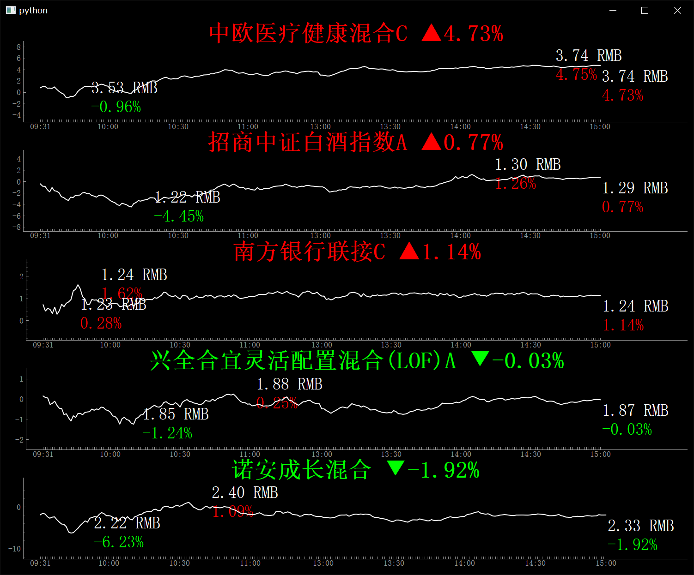

<!--
 * @Description: 
 * @Version: 1.0
 * @Autor: Zhangzixu
 * @Date: 2021-07-28 09:05:24
 * @LastEditors: Zhangzixu
 * @LastEditTime: 2021-07-28 09:05:53
-->
# FundMonitor

Simple Found Monitor Write By Python3.8

   

And you can easily add monitor list in list.csv